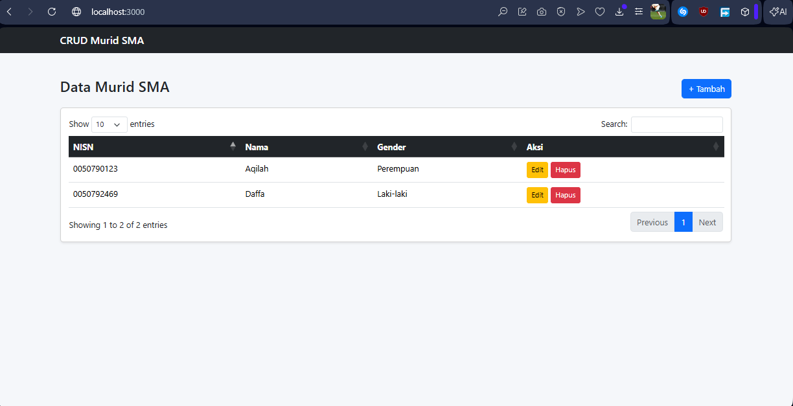
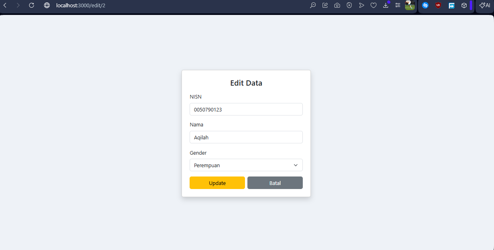
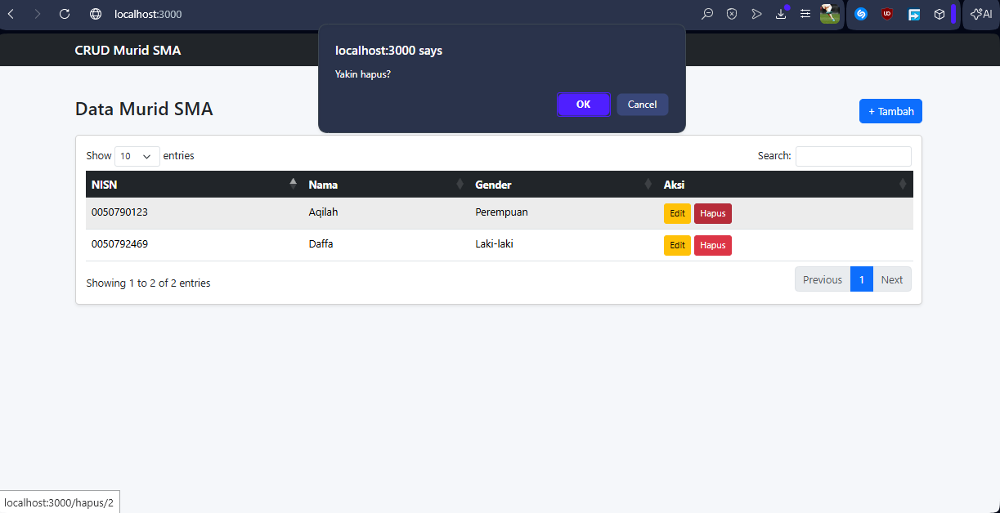
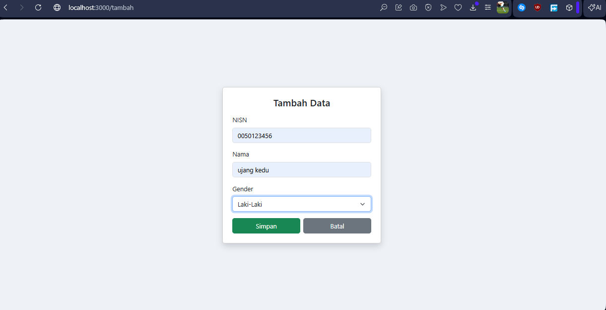
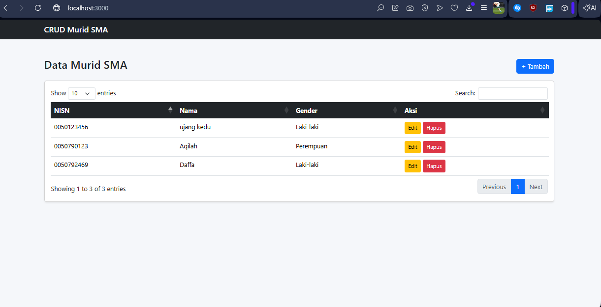

<div align="center">
  <br />
  <h1>LAPORAN PRAKTIKUM<br>APLIKASI BERBASIS PLATFORM</h1>
  <br />
  <h3>CODING ON THE SPOT<br>MANAJEMEN STOK</h3>
  <br />
   
  <br />
  <h3>Disusun Oleh :</h3>
  <p>
    <strong>Daffa Falih Aqilah</strong><br>
    <strong>2311102137</strong><br>
    <strong>PS1IF-11-REG04</strong>
  </p>
  <br />
  <h3>Dosen Pengampu :</h3>
  <p>
    <strong>Cahyo Prihantoro, S.Kom., M.Eng</strong>
  </p>
  <br />
    <h4>Asisten Praktikum :</h4>
    <strong>Gilang Saputra</strong> <br>
    <strong>Rangga Pradarrell Fathi</strong>
  <br />
  <h3>LABORATORIUM HIGH PERFORMANCE
 <br>PROGRAM STUDI TEKNIK INFORMATIKA<br>FAKULTAS INFORMATIKA<br>UNIVERSITAS TELKOM PURWOKERTO<br>2026</h3>
</div>

---

## 1. Dasar Teori

**HTML** atau HyperText Markup Language merupakan bahasa dasar yang digunakan untuk membangun sebuah web dimana HTML menangani elemen-elemen dasar pada pembangunan sebuah website.

**Cascading Style Sheets (CSS)** merupakan bahasa yang membantu memperindah tampilan dari laman web yang telah dibangun dengan HTML. CSS mendeskripsikan bagaimana bentuk tampilan elemen HTML seharusnya saat ditampilkan pada laman browser. Format penulisan CSS secara umum ditunjukkan pada gambar berikut.

**Bootstrap** merupakan sebuah front-end framework gratis untuk pengembangan antar muka web yang lebih cepat dan lebih mudah. Dikembangkan oleh Mark Otto dan Jacom Thornton di Twitter dan dirilis sebagai produk open source pada Agustus 2011 di GitHub. Bootstrap mencakup template desain berbasis HTML dan CSS untuk tipografi, form, button, navigasi, modal, image carousells dan masih banyak lagi, serta terdapat opsional plugin JavaScript. Selain itu, Bootstrapmemiliki kemampuan untuk membuat desain responsif yang secara otomatis menyesuaikan diri agar terlihat baik di segala perangkat, mulai dari perangkat ponsel hingga desktop pc.

**Javascript**, seperti namanya, merupakan bahasa pemrograman scripting. Dan seperti bahasascripting lainnya, Javascript umumnya digunakan hanya untuk program yang tidak terlalu besar,biasanya hanya beberapa ratus baris. Javascript pada umumnya mengontrol program yang berbasisJava. Jadi memang pada dasarnya Javascript tidak dirancang untuk digunakan dalam aplikasi skalabesar. 
Meskipun dibuat dengan tujuan awal untuk mengendalikan program Java, komunitas Javascript menggunakan bahasa ini untuk tujuan lain, memanipulasi gambar dan isi dari dokumen HTML. Singkatnya, pada akhirnya Javascript digunakan untuk satu tujuan utama, “menghidupkan” dokumenHTML dengan mengubah konten statis menjadi dinamis dan interaktif. Bersamaan dengan perkembangan Internet dan dunia web yang pesat, Javascript akhirnya menjadi bahasa utama dan satu-satunya untuk membuat HTML menjadi interaktif di dalam browser.

**jQuery** adalah sebuah library Javascript yang dibuat oleh John Resig pada tahun 2006. jQuery memungkinkan manipulasi dokumen HTML dilakukan hanya dalam beberapa baris code.

**Node.js** adalah runtime environment (lingkungan eksekusi) open-source dan cross-platformberbasis mesin JavaScript V8 Google Chrome. Ini memungkinkan pengembang menjalankan kode JavaScript di luar browser, sering digunakan untuk membuat aplikasi backend server yang cepat, scalable, dan efisien

**AJAX** (Asynchronous JavaScript and XML) suatu teknik pemrograman berbasis web untuk menciptakan aplikasi web interaktif. Tujuannya adalah untuk memindahkan sebagian besar interaksi pada komputer user, melakukan pertukaran data dengan server di belakang layar, sehingga halaman web tidak harus dibaca ulang secara keseluruhan setiap kali seorang penggunamelakukan perubahan. Hal ini akan meningkatkan interaktivitas, kecepatan, dan usability

**JSON (JavaScript Object Notation)** adalah format pertukaran data berbasis teks yang ringan,mudah dibaca oleh manusia, dan mudah diproses oleh mesin. JSON digunakan untuk menyimpan dan mengirimkan data antara server dan aplikasi web, yang didasarkan pada pasangan key-value(kunci-nilai) serta mendukung array.

## 2. Stuktur Folder
```
2311102137_CODING ON THE SPOT_Daffa Falih Aqilah/
│
├── 2311102137_CRUD-MURID/
│ ├── views/
│ │ ├── index.html
│ │ ├── tambah.html
│ │ └── edit.html
│ │
│ ├── server.js
│ └── package.json
│
└── README.md
```

## 3. Sourcecode 

### edit.html
``` php
<!DOCTYPE html>
<html lang="id">
<head>
    <meta charset="UTF-8">
    <title>Edit Data</title>

    <!-- Bootstrap -->
    <link href="https://cdn.jsdelivr.net/npm/bootstrap@5.3.3/dist/css/bootstrap.min.css" rel="stylesheet">
</head>

<body style="background-color: #eef2f7;">

    <div class="container d-flex justify-content-center align-items-center vh-100">
        <div class="card shadow p-4" style="width: 400px;">
            <h4 class="text-center mb-3">Edit Data</h4>

            <form action="/edit/{{id}}" method="POST">
                <div class="mb-3">
                    <label class="form-label">NISN</label>
                    <input type="text" name="nisn" class="form-control" value="{{nisn}}" required>
                </div>

                <div class="mb-3">
                    <label class="form-label">Nama</label>
                    <input type="text" name="nama" class="form-control" value="{{nama}}" required>
                </div>

                <div class="mb-3">
                    <label class="form-label">Gender</label>
                    <select name="gender" class="form-select" required>
                        <option value="Laki-laki" {{sel_l}}>Laki-laki</option>
                        <option value="Perempuan" {{sel_p}}>Perempuan</option>
                    </select>
                </div>

                <div class="d-flex gap-2">
                    <button type="submit" class="btn btn-warning w-100">Update</button>
                    <a href="/" class="btn btn-secondary w-100">Batal</a>
                </div>
            </form>
        </div>
    </div>

</body>
</html>
```
Penjelasan singkat :
<br> Program ini adalah halaman untuk mengedit data murid yang tampilannya dibuat menggunakan bootstrap, form ini menampilkan data seperti NISN, nama, dan gender yang diambil dari server, lalu admin bisa mengubah datanya dan menekan tombol Update untuk menyimpan perubahan ke server, atau tombol Batal untuk kembali ke halaman utama tanpa menyimpan perubahan.

### index.html
```html
<!DOCTYPE html>
<html lang="id">
<head>
    <meta charset="UTF-8">
    <title>Data Murid SMA</title>

    <!-- Bootstrap -->
    <link href="https://cdn.jsdelivr.net/npm/bootstrap@5.3.3/dist/css/bootstrap.min.css" rel="stylesheet">

    <!-- DataTables -->
    <link href="https://cdn.datatables.net/1.13.6/css/dataTables.bootstrap5.min.css" rel="stylesheet">
</head>

<body style="background-color: #f5f7fa;">
    <!-- Navbar -->
    <nav class="navbar navbar-dark bg-dark">
        <div class="container">
            <span class="navbar-brand mb-0 h1">CRUD Murid SMA</span>
        </div>
    </nav>

    <div class="container mt-5">
        <div class="d-flex justify-content-between align-items-center mb-3">
            <h3>Data Murid SMA</h3>
            <a href="/tambah" class="btn btn-primary">+ Tambah</a>
        </div>

        <div class="card shadow-sm p-3">
            <table id="tabelMurid" class="table table-hover">
                <thead class="table-dark text-center">
                    <tr>
                        <th>NISN</th>
                        <th>Nama</th>
                        <th>Gender</th>
                        <th>Aksi</th>
                    </tr>
                </thead>
                <tbody></tbody>
            </table>
        </div>
    </div>

    <!-- JS -->
    <script src="https://code.jquery.com/jquery-3.7.1.min.js"></script>
    <script src="https://cdn.datatables.net/1.13.6/js/jquery.dataTables.min.js"></script>
    <script src="https://cdn.datatables.net/1.13.6/js/dataTables.bootstrap5.min.js"></script>

    <script>
        $(document).ready(function() {
            $('#tabelMurid').DataTable({
                ajax: { url: '/api/murid', dataSrc: '' },
                columns: [
                    { data: 'nisn' },
                    { data: 'nama' },
                    { data: 'gender' },
                    {
                        data: null,
                        render: function(data, type, row) {
                            return `
                                <a href="/edit/${row.id}" class="btn btn-warning btn-sm">Edit</a>
                                <a href="/hapus/${row.id}" class="btn btn-danger btn-sm" onclick="return confirm('Yakin hapus?')">Hapus</a>
                            `;
                        }
                    }
                ]
            });
        });
    </script>

</body>
</html>
```
Penjelasan Singkat :
<br>Program ini adalah halaman utama yang menampilkan data murid dalam bentuk tabel, datanya diambil dari server dalam bentuk JSON menggunakan plugin jQuery DataTables, sehingga tabel bisa otomatis menampilkan data, mencari, dan mengatur halaman; selain itu, ada tombol “+ Tambah” untuk menambah data baru, serta tombol Edit dan Hapus di setiap baris untuk mengubah atau menghapus data murid.


### add.html
```html
<!DOCTYPE html>
<html lang="id">
<head>
    <meta charset="UTF-8">
    <title>Tambah Data</title>

    <link href="https://cdn.jsdelivr.net/npm/bootstrap@5.3.3/dist/css/bootstrap.min.css" rel="stylesheet">
</head>

<body style="background-color: #eef2f7;">

    <div class="container d-flex justify-content-center align-items-center vh-100">
        <div class="card shadow p-4" style="width: 400px;">
            <h4 class="text-center mb-3">Tambah Data</h4>

            <form action="/tambah" method="POST">
                <div class="mb-3">
                    <label class="form-label">NISN</label>
                    <input type="text" name="nisn" class="form-control" required>
                </div>

                <div class="mb-3">
                    <label class="form-label">Nama</label>
                    <input type="text" name="nama" class="form-control" required>
                </div>

                <div class="mb-3">
                    <label class="form-label">Gender</label>
                    <select name="gender" class="form-select" required>
                        <option value="">Pilih...</option>
                        <option value="Laki-laki">Laki-Laki</option>
                        <option value="Perempuan">Perempuan</option>
                    </select>
                </div>

                <div class="d-flex gap-2">
                    <button type="submit" class="btn btn-success w-100">Simpan</button>
                    <a href="/" class="btn btn-secondary w-100">Batal</a>
                </div>
            </form>
        </div>
    </div>

</body>
</html>
```
Penjelasan Singkat :
<br>Program ini adalah halaman untuk menambahkan data murid baru, terdapat form input seperti NISN, nama, dan gender, lalu ketika pengguna mengisi data dan menekan tombol Simpan, data tersebut akan dikirim ke server melalui metode POST ke /tambah untuk disimpan, sedangkan tombol Batal digunakan untuk kembali ke halaman utama tanpa menambah data.

### package.json
```json
{
  "name": "2311102137_crud-murid",
  "version": "1.0.0",
  "description": "",
  "main": "index.js",
  "scripts": {
    "test": "echo \"Error: no test specified\" && exit 1"
  },
  "keywords": [],
  "author": "",
  "license": "ISC",
  "type": "commonjs"
}

```
Penjelasan Singkat :
<br>Program ini adalah file package.json yang berfungsi sebagai identitas dan konfigurasi dasar project Node.js, di mana berisi informasi seperti nama project, versi, tipe module yang digunakan (commonjs), serta script yang bisa dijalankan; meskipun sederhana dan belum memakai banyak fitur, file ini penting karena digunakan oleh Node.js untuk mengenali dan mengelola project tersebut.

### server.js
``` js
const http = require('http');
const fs = require('fs');
const url = require('url');
const querystring = require('querystring');

let murid = [
    { id: 1, nisn: "0050792469", nama: "Daffa", gender: "Laki-laki" },
    { id: 2, nisn: "0050790123", nama: "Aqilah", gender: "Perempuan" }
];

const server = http.createServer((req, res) => {
    const parsedUrl = url.parse(req.url, true);
    const path = parsedUrl.pathname;

    // Halaman Tabel
    if (path === '/' && req.method === 'GET') {
        fs.readFile('./views/index.html', (err, data) => {
            res.writeHead(200, { 'Content-Type': 'text/html' });
            res.end(data);
        });
    }
    // JSON untuk Jquery Datatable
    else if (path === '/api/murid' && req.method === 'GET') {
        res.writeHead(200, { 'Content-Type': 'application/json' });
        res.end(JSON.stringify(murid));
    }
    // Halaman Tambah
    else if (path === '/tambah' && req.method === 'GET') {
        fs.readFile('./views/add.html', (err, data) => {
            res.writeHead(200, { 'Content-Type': 'text/html' });
            res.end(data);
        });
    }
    // Tambah Data
    else if (path === '/tambah' && req.method === 'POST') {
        let body = '';
        req.on('data', chunk => { body += chunk.toString(); });
        req.on('end', () => {
            const postData = querystring.parse(body);
            const newId = murid.length > 0 ? murid[murid.length - 1].id + 1 : 1;
            murid.push({ id: newId, nisn: postData.nisn, nama: postData.nama, gender: postData.gender });
            res.writeHead(302, { 'Location': '/' });
            res.end();
        });
    }
    // Halaman Edit
    else if (path.startsWith('/edit/') && req.method === 'GET') {
        const id = parseInt(path.split('/')[2]);
        const dataMhs = murid.find(m => m.id === id);
        if (dataMhs) {
            fs.readFile('./views/edit.html', 'utf8', (err, data) => {
                let html = data
                    .replace('{{id}}', dataMrd.id).replace('{{nisn}}', dataMhs.nisn).replace('{{nama}}', dataMhs.nama)
                    .replace('{{sel_l}}', dataMrd.gender === 'Laki-laki' ? 'selected' : '')
                    .replace('{{sel_p}}', dataMrd.gender === 'Perempuan' ? 'selected' : '');
                res.writeHead(200, { 'Content-Type': 'text/html' });
                res.end(html);
            });
        } else {
            res.writeHead(302, { 'Location': '/' }); res.end();
        }
    }
    // Edit Data
    else if (path.startsWith('/edit/') && req.method === 'POST') {
        const id = parseInt(path.split('/')[2]);
        let body = '';
        req.on('data', chunk => { body += chunk.toString(); });
        req.on('end', () => {
            const postData = querystring.parse(body);
            const index = murid.findIndex(m => m.id === id);
            if (index !== -1) {
                murid[index].nisn = postData.nisn; murid[index].nama = postData.nama; murid[index].gender = postData.gender;
            }
            res.writeHead(302, { 'Location': '/' });
            res.end();
        });
    }
    // Hapus Data
    else if (path.startsWith('/hapus/') && req.method === 'GET') {
        const id = parseInt(path.split('/')[2]);
        murid = murid.filter(m => m.id !== id);
        res.writeHead(302, { 'Location': '/' });
        res.end();
    }
    // 404 Not Found
    else {
        res.writeHead(404, { 'Content-Type': 'text/html' });
        res.end('<h1>404 - Halaman Tidak Ditemukan</h1>');
    }
});

server.listen(3000, () => { console.log('Server berjalan di http://localhost:3000'); });
```
Penjelasan Singkat : 
<br>Ini adalah bagian backend (server) dari aplikasi yang dibuat menggunakan Node.js  berjalan pada port 3000, yang berfungsi untuk mengatur jalannya aplikasi seperti menampilkan halaman (index, tambah, edit), menyediakan data dalam bentuk JSON untuk tabel, serta menangani proses CRUD yaitu menambah, mengedit, dan menghapus data murid yang disimpan sementara dalam array; server ini juga mengatur routing berdasarkan URL yang diakses pengguna dan mengirimkan respon yang sesuai, sehingga aplikasi bisa berjalan secara dinamis meskipun tanpa database.


## 4. Halaman
Berikut Website Data Murid SMA ini memiliki struktur halaman sebagai berikut :

### Halaman Home
Halaman home pada aplikasi ini merupakan halaman utama yang menampilkan data murid dalam bentuk tabel menggunakan Bootstrap dan plugin jQuery DataTables, sehingga tampilannya rapi dan interaktif; data murid seperti NISN, nama, dan gender diambil dari server dalam format JSON lalu ditampilkan secara otomatis, lengkap dengan fitur pencarian, pagination (halaman), dan jumlah data per halaman, selain itu terdapat tombol “+ Tambah” untuk menambahkan data baru, serta tombol Edit dan Hapus di setiap baris yang berfungsi untuk mengubah atau menghapus data murid secara langsung.



### Edit & Hapus
Fitur Edit digunakan untuk mengubah data murid yang sudah ada. Ketika tombol Edit ditekan, pengguna akan diarahkan ke halaman form edit yang sudah terisi otomatis dengan data sebelumnya (seperti NISN, nama, dan gender). Pengguna bisa mengubah data tersebut lalu menekan tombol Update untuk menyimpan perubahan ke server, sehingga data di tabel akan diperbarui.



Fitur Hapus digunakan untuk menghapus data murid dari tabel. Saat tombol Hapus ditekan, akan muncul konfirmasi “Yakin hapus?” untuk memastikan pengguna tidak salah menghapus data. Jika pengguna menekan OK, maka data akan dihapus dari server dan langsung hilang dari tabel.



### Halaman Tambah Data
Halaman Tambah Data digunakan untuk memasukkan data murid baru ke dalam sistem. Pada halaman ini terdapat form yang berisi input seperti NISN, nama, dan gender. Pengguna mengisi data tersebut, lalu menekan tombol Simpan untuk mengirim data ke server sehingga akan ditambahkan ke dalam tabel utama. Jika pengguna tidak jadi menambah data, bisa menekan tombol Batal untuk kembali ke halaman utama tanpa menyimpan.



Setelah menekan tombol simpan maka data Murid SMA akan muncul pada tabel



## Kesimpulan
Aplikasi Data Murid SMA ini berhasil dibangun sebagai aplikasi web sederhana menggunakan Node.js sebagai backend dan Bootstrap sebagai frontend untuk menghasilkan tampilan yang rapi dan responsif. Aplikasi ini telah mengimplementasikan fitur CRUD (Create, Read, Update, Delete) secara lengkap, sehingga pengguna dapat menambah, melihat, mengedit, dan menghapus data murid dengan mudah.

Data murid ditampilkan dalam bentuk tabel interaktif menggunakan jQuery dan plugin DataTables, di mana data diambil dari server dalam format JSON. Hal ini memungkinkan fitur seperti pencarian, pagination, dan pengolahan data berjalan secara otomatis tanpa perlu memuat ulang halaman secara keseluruhan.

## Link Video Rekaman Presentasi
[..]